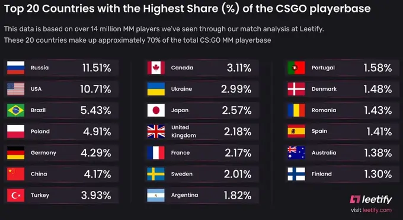
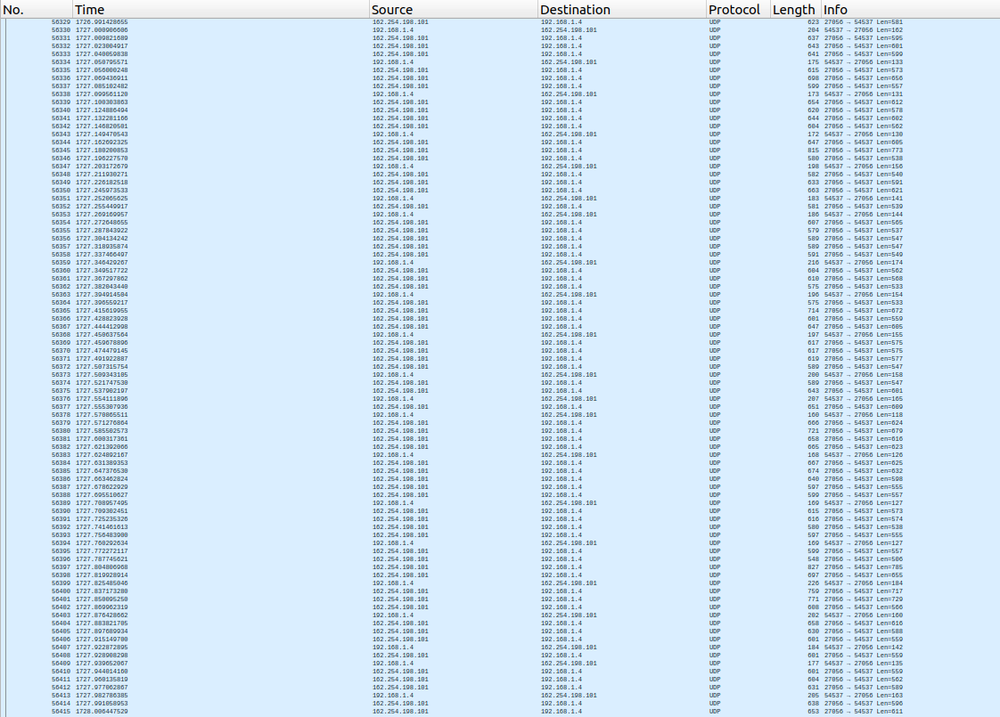
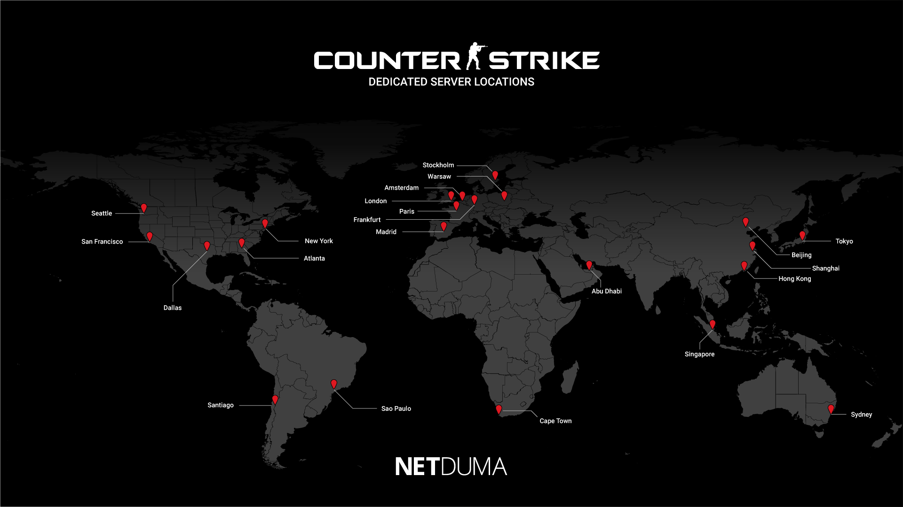
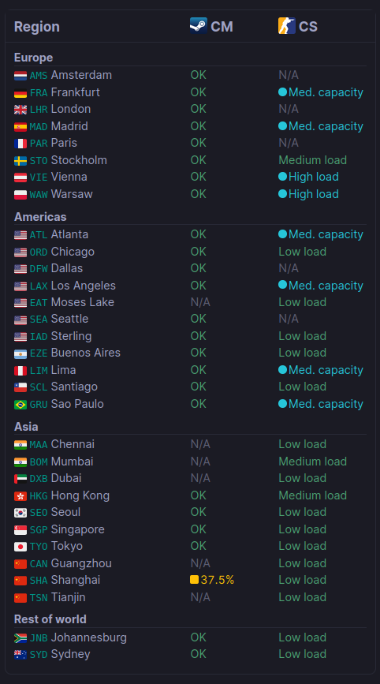

# CS: <s>GO</s> 2 System Design
*28.09.2023 года игра сменила название с CS:GO на CS:2

## Содержание

* [Тема и целевая аудитория](#1)
* [Расчет нагрузки](#2)
* [Логическая схема](#3)
* [Физическая схема](#4)
* [Технологии](#5)
* [Схема проекта](#6)
* [Список серверов](#7)

## 1. Тема и целевая аудитория 

**Counter Strike: Global Offensive** — многопользовательский шутер от первого лица, разработанный компаниями Valve и Hidden Path Entertainment.

### MVP
- Подбор матча на основе ELO и геолокации
- Двусторонняя отправка запросов игрок-сервер в реальном времени
- Просмотр игровой статистики
- Интеграция с Торговой площадкой Steam
  - Во время игры может случайным образом выпасть предмет, который затем можно продать

### Целевая аудитория

[CS:GO имеет 43,3 млн активных пользователей в месяц](https://activeplayer.io/counter-strike-global-offensive/) (август 2023).

[Распределение игроков по странам](https://cybersport.metaratings.ru/news/rossiya-vozglavila-spisok-stran-po-kolicestvu-igrokov-v-matcmeikinge-csgo-44609/) (июль 2022).

## 2. Расчет нагрузки 

### Продуктовые метрики

- Месячная аудитория - 43,3 млн человек
- Играют одновременно в среднем [900 тысяч человек](https://steamcharts.com/app/730)
  - Число людей, непосредственно находящихся в матче, меньше
- Среднее количество действий пользователя по типам в день
  1. Подбор матча.
     TBD
  2. Двусторонняя отправка запросов игрок-сервер в реальном времени.
      - Есть разные типы матчей
        - MM (MatchMaking, основной) длится около 40 минут.   
        - Deathmatch, гонка вооружений и др. длятся около 15 минут.
      - В среднем возьмем 20 минут.
      - Скриншот из Wireshark, зафиксирована 1 секунда во время матча 
        - От сервера (162.254.198.101, Стокгольм) пришло чуть более 60 пакетов, каждый из которых в среднем весит 600 байт
          - Тикрейт официальных серверов - 60
        - От клиента к серверу было отправлено 22 пакета, каждый из которых в среднем весит 160 байт
          - Так мало пакетов могло быть отправлено из-за недостаточных технических характеристик оборудования для игры
            - Я играл с 20-30 FPS
  3. Получение после матча игровых предметов, связанных с Торговой площадкой
      - TBD определить, сколько предметов выпадает ежедневно  

### Технические метрики
От сервера к 1 клиенту передается  
60 * 600 * 8 = 288 * 10^3 бит в секунду

Постоянно в игре находятся 900к человек, непосредственно в матче - условно 400-500к  
От сервера ко всем игрокам передается  
288 * 10^3 * 5 * 10^5 = 1440 * 10^8 = 144 * 10^9 бит в секунду

## 3. Логическая схема 

## 4. Физическая схема 

## 5. Технологии 

## 6. Схема проекта 

## 7. Список серверов 

### Глобальная балансировка

Низкий пинг является неотъемлемой частью игры в шутер, поэтому нагрузка будет распределяться с помощью Latency-based DNS.

### Физическое расположение датацентров

Физическое расположение датацентров, [карта](https://netduma.com/blog/csgo-server-locations/)

Несмотря на то, что в России больше всего игроков (11,51% ото всех игроков, в США - 10,71%), датацентры на Урале и в Сибири полностью отсутствуют.

Физическое расположение датацентров, [список](https://steamstat.us/)  
